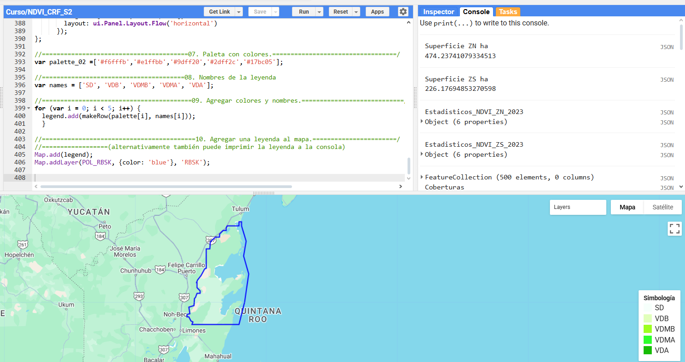
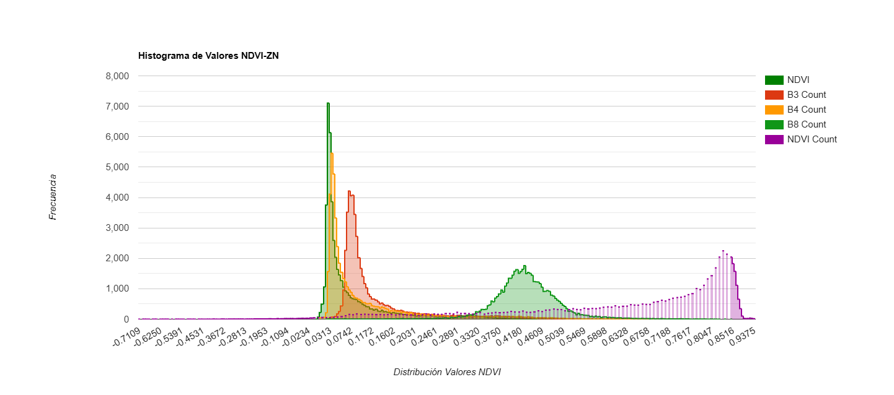
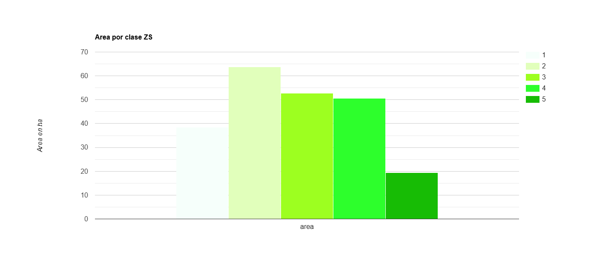
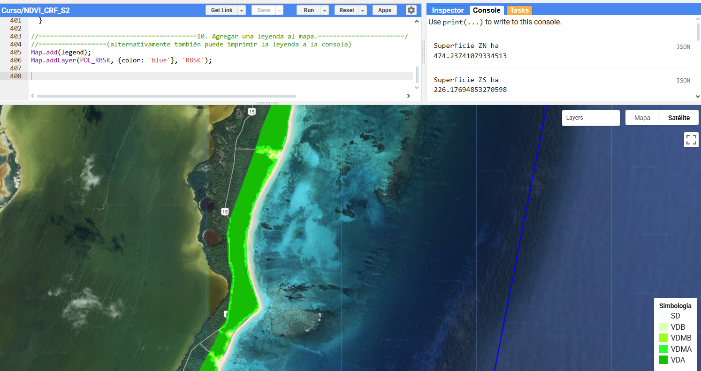
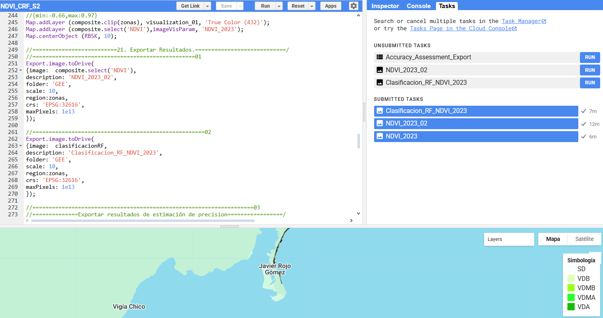

# Clasificacion_Supervisada_RF_NDVI
Estimación de umbrales y clasificación supervisada mediante algoriymo random forest (RF) con NDVI sobre colección armonizada S2, tomado y ajustado en Google Earth Engine (GEE).
# Desarrollo de código y obtención de información para el estudio de la densidad de la cobertura vegetal mediante NDVI, aplicado a S2 en duna costera.

## Descripción 📋
El presente script esta desarrollado para obtener una clasificación supervisada a través del modelo RF con umbrales de NDVI sobre la densidad de la cobertura vegetal, aplicado a la colección armonizada S2 dentro de GEE, para la region central del Caribe Mexicano, donde se ubica la Reserva de la Bisofera de Sian Ka´an (RBSK), Quintana Roo, México. Clasificando los pixeles de las bandas ópticas que se relacionan con los pixeles de los umbrales de NDVI, asignándolos a las clases propuestas en este estudio. Información que puede ser descargada para su manejo externo. [**GEE**](https://developers.google.com/earth-engine/guides/getstarted?hl=en).

El repostirorio se elaboró de acuerdo a los lineamientos de la [**licencia GNU General Public License v3.0.**](https://choosealicense.com/licenses/gpl-3.0/).

##Visualización de la Reserva de la Bisofera de Sian Ka´an (RBSK) y zonas de estudio en GEE.

;  

Estimaciones.

Con la ejecución de este script obtendrá umbrales de NDVI, histogramas de NDVI con las bandas ópticas de S2, superficie de cada por zona de estudio y estadisticos derivados de RF para el año 2023. Información generada para la duna costera en la zona norte y sur de la RBSK.SD. *Clases = SD: Suelo desnudo, VDB: Vegetación densidad baja, VDMB: Vegetación densidad media baja, VDMA: Vegetación densidad media alta y VDA: Vegetación densidad alta.
Resultados:

1.  

2. 

*Clases = 1: SD, 2: VDB, 3: VDMB, 4: VDMA, 5: VDA.

3.  

4. 

### Capas raster a exportar. 
Visualización de la Reserva de la Bisofera de Sian Ka´an (RBSK), mediante NDVI aplicado a la colección armonizada S2, exhibiendo clasificación supervisada con RF en GEE. Las capas raster a exportar se ubican dentro de la pestaña Tasks, para su descarga en google drive y posteriormente ser descargadas a la PC personal para su manipulación.

La manipulación de la información contenida en los rasaters puede realizarse, a traves, del sistema de información geografica de su preferencia. Para el presente caso de estudio se utilizó el software de acceso libre QGIS.

